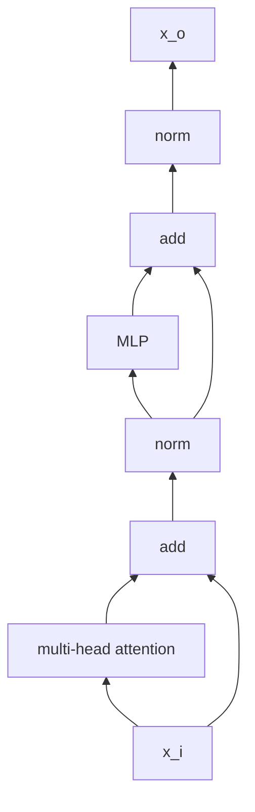
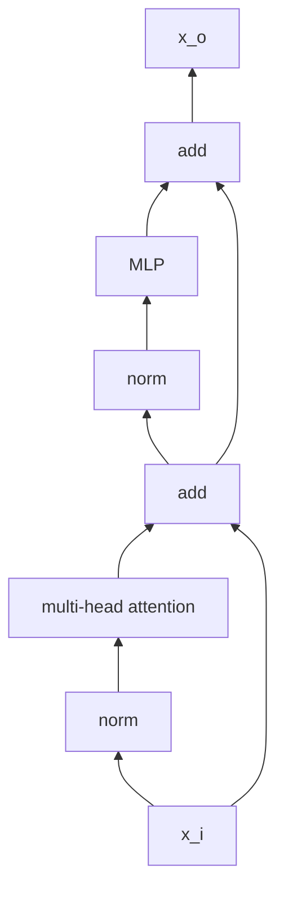

## [2017 NIPS@Google] Attention is All You Need
---
!TODO: 精读

Attention (Scaled Dot-Product Attention) 的定义: 
$$\mathrm{Attention}(Q,K,V) = \mathrm{softmax}\left(\frac{QK^{\top}}{\sqrt{d_k}}\right)V$$

符号说明: 
1) $Q\in\mathbb{R}^{n\times d_k}$ 为 query, $n$ 是 target sequence length.
2) $K\in\mathbb{R}^{m\times d_k}$ 为 key, $m$ 是 source sequence length.
3) $V\in\mathbb{R}^{m\times d_v}$ 为 value.

最终的 $\mathrm{Attention}(Q,K,V)$ 的尺寸为 $n\times d_v$, 也就是说 attention 将 $n\times d_k$ 的 $Q$ 编码成了一个新的 $n\times d_v$ 的序列, 即 attention 没有改变 $Q$ 的序列长度 (sequence length), 但维度可能会有变化. 

关于为什么要除以 $\sqrt{d_k}$, 下面摘抄一下原文:
> We suspect that for large values of $d_k$, the dot products grow large in magnitude, pushing the softmax function into regions where it has extremely small gradients. To counteract this effect, we scale the dot products by $1/\sqrt{d_k}$ .

**Opinions** (自己理解): 
1) softmax 函数是多元函数 (自变量是向量), 上面式子中的 softmax 函数的自变量是矩阵, 与定义不符, 此处的 `softmax(x)` 应该理解为 `torch.nn.functional.softmax(x, dim=1)` (借用 pytorch 中的函数.)
2) $K$ 和 $V$ 总是成对出现的 (key-value pair 也是生活中的常见词汇, $K$ 和 $V$ 的序列长度是一样的, 但维度可以不同), 例如在交叉注意力中, $K$ 和 $V$ 来自同一个模态, $Q$ 来自另一个模态.
3) Attention 公式的助记口诀: `Q-KTV`.
4) Attention 的作用简单说就是: 利用 $K$ 和 $V$ 来增强 $Q$ 的特征表达能力.


### 带投影的 Scaled Dot-Product Attention

$$ \mathrm{Attention}(QW^Q, KW^K, VW^V)W^O$$

$Q\in\mathbb{R}^{n\times e_q}$ 为 query embedding, $n$ 为 target sequence length, $e_q$ 为 query embedding dimension.

$K\in\mathbb{R}^{m\times e_k}$ 为 key embedding, $m$ 为 source sequence length, $e_k$ 为 key embedding dimension.

$V\in\mathbb{R}^{m\times e_v}$ 为 value embedding, $m$ 为 source sequence length, $e_v$ 为 value embedding dimension.

$W^Q \in \mathbb{R}^{e_q\times d_k}$ 为 query projection matrix.

$W^K \in \mathbb{R}^{e_k\times d_k}$ 为 key projection matrix.

$W^V \in \mathbb{R}^{e_v\times d_v}$ 为 value projection matrix.

$W^O \in \mathbb{R}^{d_v\times d_o}$ 为 output projection matrix.

$QW^Q \in \mathbb{R}^{n\times d_k}$ 为 query.

$KW^K \in \mathbb{R}^{m\times d_k}$ 为 key.

$VW^V \in \mathbb{R}^{m\times d_v}$ 为 value.

最终输出的尺寸为 ${n\times d_o}$.

注意到: $W^Q, W^K, W^V, W^O$ 这些参数的尺寸与 $n$ 或 $m$ 均无关系, 即参数与序列长度无关.

在 Pytorch 的 `nn.MultiheadAttention` 中, 有 $e_q = d_k = d_v = d_o$, 由下面关键代码可见
```python
self.q_proj_weight = Parameter(torch.empty((embed_dim, embed_dim), **factory_kwargs))
self.k_proj_weight = Parameter(torch.empty((embed_dim, self.kdim), **factory_kwargs))
self.v_proj_weight = Parameter(torch.empty((embed_dim, self.vdim), **factory_kwargs))
self.out_proj = NonDynamicallyQuantizableLinear(embed_dim, embed_dim, bias=bias, **factory_kwargs)
```

在 transformers 的 `BertModel` 中, 亦有 $e_q = d_k = d_v = d_o$, 同时还有 $e_q = e_k = e_v$, 由下面关键代码可见
```python
# 在 BertSelfAttention 中, self.all_head_size 实际上等于 config.hidden_size,
self.query = nn.Linear(config.hidden_size, self.all_head_size)
self.key = nn.Linear(config.hidden_size, self.all_head_size)
self.value = nn.Linear(config.hidden_size, self.all_head_size)
# 在 BertSelfOutput 中
self.dense = nn.Linear(config.hidden_size, config.hidden_size)
```

### 多头注意力 (Multi-Head Attention; MHA)

$$\mathrm{MultiHead}(Q, K, V) = \mathrm{Concat}(\mathrm{head}_1, ..., \mathrm{head}_h)W_O$$

$$\mathrm{head}_i = \mathrm{Attention}(QW_i^Q, KW_i^K, VW_i^V)$$

其中 $h$ 表示头的个数. 多头自注意力 (Multi-head Self Attention; MSA, MHSA) 是多头注意力的特例.


### 特殊的 token
> 初始化方式
> 
> Just like other tokens, the CLS token is randomly initialized from a normal distribution. The only exception is the padding token, which is set to zero.

### PostNorm 和 PreNorm

PostNorm: $X_{t+1} = \mathrm{Norm}(X_t + F_t(X_t))$

PreNorm: $X_{t+1} = X_t + F_t(\mathrm{Norm}(X_t))$

**PostNorm**



**PreNorm**



### References
- [《Attention is All You Need》浅读（简介+代码）](https://kexue.fm/archives/4765)
- [[2017] Attention is All You Need](https://arxiv.org/pdf/1706.03762.pdf)
- https://stackoverflow.com/questions/65703260/computational-complexity-of-self-attention-in-the-transformer-model
- http://nlp.seas.harvard.edu/2018/04/03/attention.html


## [2020 ICML] iGPT
---
- [2020 ICML@OpenAI] Generative pretraining from pixels


## [2020 @Google] ViT, Vision Transformer
---
!TODO: 精读

iGPT 和 ViT 是 transformer 在 CV 中的两大先驱工作.

若图像尺寸为 $W\times H$, 通道数为 $C$, patch 尺寸为 $P_W \times P_H$ (注意 $P_W$ 要能整除 $W$, 且 $P_H$ 要能整除 $H$), 则图像可以转化为 $\frac{W}{P_W} \times \frac{H}{P_H}$ 个 patch , 每个 patch 的维度为 $P_W \times P_H \times C$, 即转化为序列长度 (`seq_length`) 为 $\frac{W}{P_W} \times \frac{H}{P_H}$, 隐层特征维度 (`hidden_dim`) 为 $P_W \times P_H \times C$ 的张量. 可以用步长为 $P$, 卷积核尺寸为 $P \times P$ 的卷积来实现图像分块.

例子: 若图像尺寸为 224x224, 通道数为 3, patch 尺寸为 16x16, 则图像可以转化为 196 (`(224 / 16) * (224 / 16)`) 个 patch, 每个 patch 的维度为 768 (`16 * 16 * 3`).

ViT 网络结构与 CNN 相比没有以下两个归纳偏置 (inductive bias, 可以理解为先验知识): 局部连接 (locality), 平移等变性 (translation equivariance). 但不能说 ViT 没有任何关于图像的归纳偏置, 文中有述 (即对输入图像进行缩放, 以及分块操作是有归纳偏置.)
> Note that this resolution adjustment and patch extraction are the only points at which an inductive bias about the 2D structure of the images is manually injected into the Vision Transformer.

B/32 和 B/16 的 ViT 在参数量上是相同的 (ViT 之前的 linear projection 会将所有的 vectorized patch 变成相同的维度).

**One sight**: On the other hand, transformers are known for their fixed dimensionality throughout the model, and as a result, plain ViTs downsample inputs aggressively from the very beginning to alleviate the quadratic cost of self attention, which in turn hinders the application of plain ViTs as backbones to dense vision tasks.


### ViT 网络结构

name             | parameters 
-----------------|------------
ViT-Base, ViT-B  | 86M
ViT-Large, ViT-L | 307M
ViT-Huge, ViT-H  | 632M


### ViT 开源模型之 HuggingFace
    google/vit-base-patch16-224
    google/vit-base-patch16-224-in21k
    google/vit-base-patch16-384
    google/vit-base-patch32-384
    google/vit-base-patch32-224-in21k
    google/vit-large-patch16-224
    google/vit-large-patch16-224-in21k
    google/vit-large-patch16-384
    google/vit-large-patch32-224-in21k
    google/vit-large-patch32-384
    google/vit-huge-patch14-224-in21k
    google/vit-hybrid-base-bit-384

- 不带 in21k 后缀的表示: 在 ImageNet-21k 上做预训练, 然后在 ImageNet 上做微调
- 带 in21k 后缀的表示: 直接上 ImageNet-21k 上做训练.

### ViT 开源模型之 timm
    timm/vit_giant_patch14_dinov2.lvd142m


### References
- [2020 @Google] An image is worth 16x16 words_ Transformers for image recognition at scale
- https://github.com/google-research/vision_transformer


## [2020 @Facebook] DeiT, Data-efficient image Transformers
---
对 ViT 的训练方式做了改进, 提出了 distillation token 的概念, 它的监督信号是 teacher model 的 hard 或 soft 标签. 

提出了两个轻量级网络, 作为 ViT 的补充.

name      | parameters | counterpart
----------|------------|---------
DeiT-Ti   | 5M         | ResNet18
DeiT-S    | 22M        | ResNet50


### DeiT 开源模型之 HuggingFace
    facebook/deit-tiny-patch16-224
    facebook/deit-tiny-distilled-patch16-224
    facebook/deit-small-patch16-224
    facebook/deit-small-distilled-patch16-224
    facebook/deit-base-patch16-224
    facebook/deit-base-distilled-patch16-224
    facebook/deit-base-patch16-384
    facebook/deit-base-distilled-patch16-384
    
### References
- [2020 @Facebook] Training data-efficient image transformers & distillation through attention
- https://github.com/facebookresearch/deit


## [2021] Early Convolutions Help Transformers See Better
---
基本思想: 在 ViT 中, 用多个小尺寸小步长的卷积层替换原来的一个大尺寸大步长的卷积层.

## [2021] Swin Transformer
---
Swin 系 shifted window (注意不是 sliding window) 的缩略词.

注意区分 patch 和 window 的概念.

Swin Transformer V2 使用 scaled cosine attention 替换常见的 scaled dot-product attention.

### text token 和 visual token 之间的区别
> We observe that significant chalenges in transferring its high performance in the language domain to the visual domain can be explained by differences between the two modalities. One of these differences involves scale. Unlike the word tokens that serve as the basic elements of processing in language Transformers, visual elements can vary substantially in scale, a problem that receives attention in tasks such as object detection [41, 52, 53]. In existing Transformer-based models [61, 19], tokens are all of a fixed scale, a property unsuitable for these vision applications. Another difference is the much higher resolution of pixels in images compared to words in passages of text. There exist many vision tasks such as semantic segmentation that require dense prediction at the pixel level, and this would be intractable for Transformer on high-resolution images, as the computational complexity of its self-attention is quadratic to image size.

### 网络结构

name          | parameters | counterpart
--------------|------------|----------
Swin-T        | 29M        | ResNet-50, DeiT-S
Swin-S        | 50M        | ResNet-101
Swin-B        | 88M        | ViT-B
Swin-L        | 197M       | 
SwinV2-T      | 29M        | 
SwinV2-S      | 50M        | 
SwinV2-B      | 88M        | 
SwinV2-L      | 197M       | 
SwinV2-G      | 3.0B       | 


- [2021] Swin transformer: Hierarchical vision transformer using shifted windows
- [2021] Swin Transformer V2: Scaling Up Capacity and Resolution


## [2022] DaViT
---
- [2022] DaViT_ Dual Attention Vision Transformers

## [2021 ICCV] PVT, Pyramid vision transformer
----
- [2021 ICCV] Pyramid vision transformer: A versatile backbone for dense prediction without convolutions
- [2021] PVTv2_ Improved Baselines with Pyramid Vision Transformer

## [2021] CvT, convolutions to vision transformers
----
- [2021] Cvt: Introducing convolutions to vision transformers

## [2021 ICCV] ViL
----
- [2021 ICCV] Multi-scale vision longformer: A new vision transformer for high-resolution image encoding

## [2021 CVPR] HaloNet
----
- [2021 CVPR] Scaling local self-attention for parameter efficient visual backbones

## [2021] Twins
----
- [2021] Twins: Revisiting spatial attention design in vision transformers

## [2022 ICLR] MobileViT, MobileViT v2, MobileViT v3
----
论文指出, 在移动设备上, ViT 系列的模型推理速度明显比 CNN 系列的模型要慢. 

- [2022 ICLR] MobileViT: Light-weight, General-purpose, and Mobile-friendly Vision Transformer
- [2022] Separable Self-attention for Mobile Vision Transformers
- [2022] MobileViTv3: Mobile-Friendly Vision Transformer with Simple and Effective Fusion of Local, Global and Input Features

## [2021] CPVT
----
CPVT uses 3 × 3 Conv together with the PE to implement a data-driven PE (positional encoding).

- [2021] Conditional positional encodings for vision transformers

## [2021] Benchmarking detection transfer learning with vision transformers
----

## [2022] Exploring plain vision transformer backbones for object detection
----

## [2021 CVPR @Google] ViT-G
----
ViT-G/14 包含 2B 参数量.

- [2022 CVPR @Google] Scaling Vision Transformers

## [2022] ViT-e
----
- [2022] PaLI: A jointly-scaled multilingual language-image model

## [2023 @Google] ViT-22B
----
- [2023 @Google] Scaling Vision Transformers to 22 Billion Parameters

## [2021] How to train your ViT? Data, Augmentation, and Regularization in Vision Transformers
----
>  In comparison to convolutional neural networks, the Vision Transformer's weaker inductive bias is generally found to cause an increased reliance on model regularization or data augmentation ("AugReg" for short) when training on smaller training datasets.

## [2022] DiNAT
----
- [2022] Dilated Neighborhood Attention Transformer

## [2021 @Facebook] CaiT 
----
主要贡献是提出了 LayerScale.

- [2021 @Facebook] Going deeper with Image Transformers

## [2020] GLU Variants Improve Transformer
---

## [2025] Scaling Laws in Patchification_ An Image Is Worth 50,176 Tokens And More
---
主要思想是: 一个 token 一个像素效果最好.

