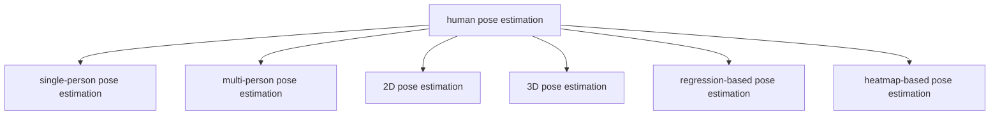

# Overview

# Codes
- https://github.com/bearpaw/pytorch-pose
- https://github.com/princeton-vl/pose-ae-train
- https://github.com/cbsudux/awesome-human-pose-estimation

# Papers

## DeepPose
---
- [2014 CVPR] DeepPose_ Human Pose Estimation via Deep Neural Networks

## [2014 NIPS] Joint training of a convolutional network and a graphical model for human pose estimation
---
该文献是比较早的一篇 heatmap-based 的人体姿态估计算法

## [2014 CVPR] 2d Human Pose Estimation_ New Benchmark and State of the Art Analysis
---

## CPM, Convolutional Pose Machines
---
- [2016 CVPR] Convolutional Pose Machines
- https://github.com/shihenw/convolutional-pose-machines-release
- https://github.com/timctho/convolutional-pose-machines-tensorflow

## DeepCut, DeeperCut
---
DeepCut 和 DeeperCut 属于自底向上 (bottom-up) 的 multi-person pose estimation 算法.

- [2016 CVPR] DeepCut: Joint Subset Partition and Labeling for Multi Person Pose Estimation
- [2016 ECCV] DeeperCut: A Deeper, Stronger, and Faster Multi-Person Pose Estimation Model
- https://github.com/eldar/pose-tensorflow

## AlphaPose
---
- http://mvig.org/research/alphapose.html
- https://github.com/MVIG-SJTU/AlphaPose
- [2017 ICCV] RMPE_ Regional Multi-person Pose Estimation

## OpenPose
---
- [2018] OpenPose_ realtime multi-person 2D pose estimation using Part Affinity Fields
- https://github.com/CMU-Perceptual-Computing-Lab/openpose
- https://github.com/ildoonet/tf-pose-estimation

## Stacked hourglass networks
---
- [2016] Stacked hourglass networks for human pose estimation.

## [2018 ECCV] SimplePose, SimpleBaseline
---
- [2018 ECCV] Simple Baselines for Human Pose Estimation and Tracking
- https://github.com/Microsoft/human-pose-estimation.pytorch

## [2018 CVPR] CPN, Cascaded Pyramid Network
---
该文献的网络结构类似于 PANet.

> Our models are only trained on MS COCO[27] trainval dataset (includes 57K images and 150K person instances) and validated on MS COCO minival dataset (includes 5000 images). The testing sets includes test-dev set (20K images) and test-challenge set (20K images).

- [2018 CVPR] Cascaded Pyramid Network for Multi-Person Pose Estimation
- https://github.com/chenyilun95/tf-cpn

## [2019] MSPN, multi-stage pose estimation network
---
- [2019] Rethinking on Multi-Stage Networks for Human Pose Estimation

## [2019 CVPR] Fast Human Pose Estimation
---
- https://github.com/ilovepose/fast-human-pose-estimation.pytorch

## [2019 CVPR] HRNet
---
- [2019 CVPR] Deep High-Resolution Representation Learning for Human Pose Estimation
- https://github.com/HRNet/Higher-HRNet-Human-Pose-Estimation

## [2019 CVPR] PifPaf_ Composite Fields for Human Pose Estimation
---
- https://github.com/vita-epfl/openpifpaf

## [2019 ICCV] Camera Distance-aware Top-down Approach for 3D Multi-person Pose Estimation from a Single RGB Image
---
- https://github.com/mks0601/3DMPPE_POSENET_RELEASE

## [2019 CVPR] V2V-PoseNet: Voxel-to-Voxel Prediction Network for Accurate 3D Hand and Human Pose Estimation from a Single Depth Map
---
- https://github.com/mks0601/V2V-PoseNet_RELEASE

## [2020] HigherHRNet
---
- [2020] HigherHRNet_ Scale-Aware Representation Learning for Bottom-Up Human Pose Estimation

## [2018 ECCV] Integral Pose
---
This paper leverage the soft-argmax operation to retrieve joint locations from heatmaps in a differentiable manner, which allows end-to-end training. It prevents quantization error.

- [2018 ECCV] Integral human pose regression

## [2021] Lite-HRNet, LiteHRNet
---
- [2021] Lite-HRNet_ A Lightweight High-Resolution Network

## [2021] EfficientPose
---
- [2021] EfficientPose: Efficient human pose estimation with neural architecture search

## [2022 CVPR] LitePose
----
- [2022 CVPR] Lite Pose: Efficient Architecture Design for 2D Human Pose Estimation

## [2017] Towards Accurate Multi-person Pose Estimation in the Wild
----
- [2017] Towards Accurate Multi-person Pose Estimation in the Wild

## [2020] BlazePose
----
- [2020] BlazePose_ On-device Real-time Body Pose tracking

# Datasets & Challenges

## FLIC
---
**References**:
- [2013 CVPR] Modec: Multimodal Decomposable Models for Human Pose Estimation

## LSP, Leeds Sports Poses
---
**References**:
- [2010 BMVC] Clustered Pose and Nonlinear Appearance Models for Human Pose Estimation

## LIP, Look Into Person
---
We present a new large-scale dataset focusing on semantic understanding of person. The dataset is an order of magnitude larger and more challenge than similar previous attempts that contains 50,000 images with elaborated pixel-wise annotations with 19 semantic human part labels and 2D human poses with 16 key points. The images collected from the real-world scenarios contain human appearing with challenging poses and views, heavily occlusions, various appearances and low-resolutions.

**References**:
- http://sysu-hcp.net/lip/
- [2018 CVPR] Instance-level Human Parsing via Part Grouping Network
- [2017 CVPR] Look into Person: Self-supervised Structure-sensitive Learning and A New Benchmark for Human Parsing

## Humaneva
---
**References**:
- [2010 IJCV] HumanEva: Synchronized Video and Motion Capture Dataset and Baseline Algorithm for Evaluation of Articulated Human Motion

## Human3.6M
---
The Human3.6M dataset is composed by videos with 11 subjects performing 17 different activities and 4 cameras with different points of view, resulting in more than 3M frames. For each person, the dataset provides 32 body joints, from which only 17 are used to compute scores.

**References**:
- [2014 TPAMI] Human3.6M: Large Scale Datasets and Predictive Methods for 3D Human Sensing in Natural Environments

## The Total Capture Dataset
---
**References**:
- [2017 BMVC] Total capture_ 3D human pose estimation fusing video and inertial sensors

## Parse
---
It is a relatively small data set as it contains only 305 images.

**References**:
- [2017 NIPS] Learning to parse images of articulated bodies

## MPII
---
The MPII dataset for single person pose estimation is composed of about 25K images of which 15K are training samples, 3K are validation samples and 7K are testing samples (which labels are withheld by the authors). The images are taken from YouTube videos covering 410 different human activities and the poses are manually annotated with up to 16 body joints.

The MPII human pose dataset, which covers a wide range of human activities with 25k images containing over 40k people.

**References**:
- [2014 CVPR] 2d human pose estimation_ New benchmark and state of the art analysis

## 3D Human Pose Estimation
---
**References**:
- [2016 ECCV] Towards Viewpoint Invariant 3D Human Pose Estimation
- https://www.albert.cm/projects/viewpoint_3d_pose/

## PoseTrack
---
PoseTrack is a large-scale benchmark for human pose estimation and articulated tracking in video. 

**References**:
- https://posetrack.net/

## DensePose 
---
**References**:
- http://densepose.org/

## COCO keypoint
---
**References**:
- [2014 ECCV] Microsoft coco: Common objects in context
