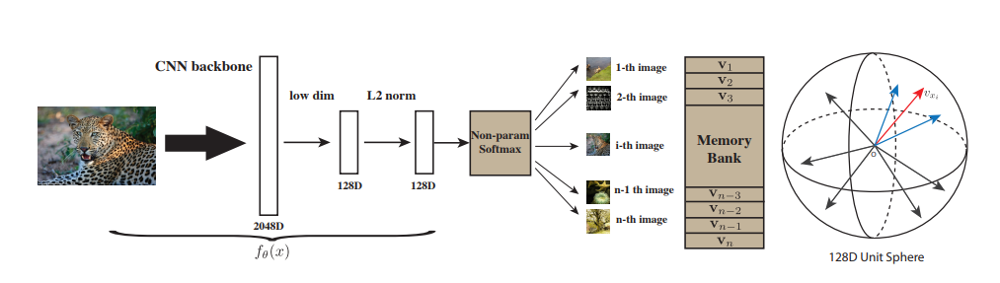
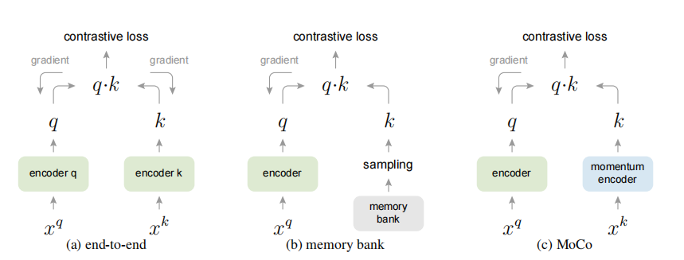
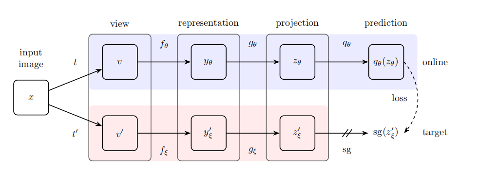
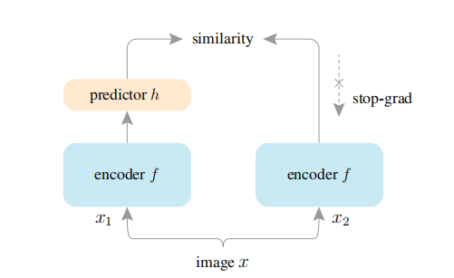
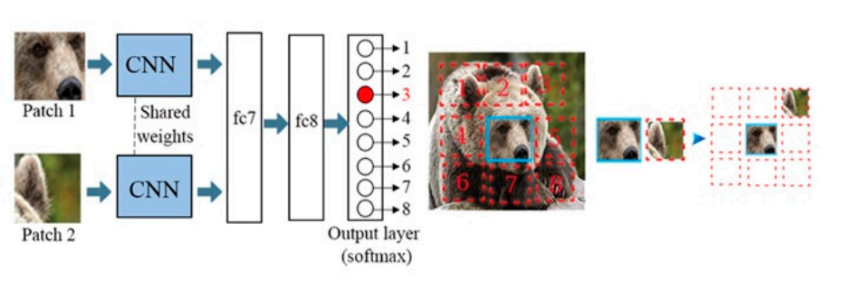
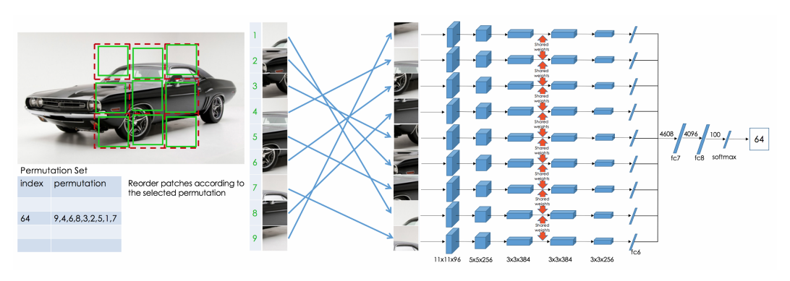
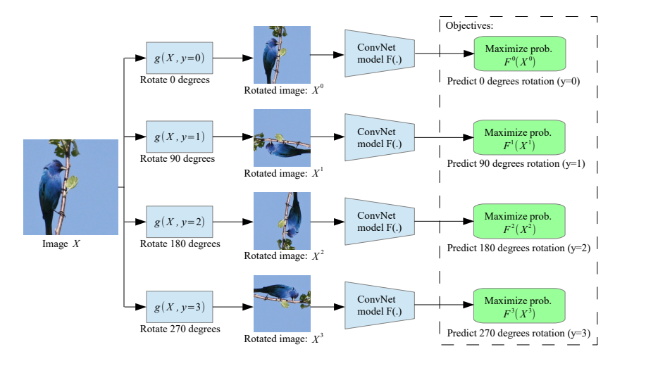

# *Self-supervised*

## [2014 NIPS] Exemplar CNN
---
- [2014 NIPS] Discriminative unsupervised feature learning with convolutional neural networks

## [2018 ECCV] Deep clustering for unsupervised learning of visual features
---

## [2018 CVPR] InstDisc, non-parametric instance discrimination
---
> Our novel unsupervised feature learning approach is instance-level discrimination. We treat each image instance as a distinct class of its own and train a classifier to distinguish between individual instance classes.

### 算法框架


### 损失函数

$$\ell_{i} = -\log \frac{\exp(\mathrm{sim}(f_i, v_{y_i})/\tau)}{\sum_{j=1}^{n} \exp(\mathrm{sim}(f_i, v_j)/\tau)}$$

其中 $n$ 等于训练集样本数目, $\mathrm{sim}(\cdot,\cdot)$ 是余弦相似度函数, $\tau$ 是温度参数. $v_j$ 是 memory bank 中的特征, $f_i$ 是网络的输出特征.

附上交叉熵损失函数的数学形式, 以作对比:

$$\ell_{i} = -\log \frac{\exp(f_i^Tw_{y_i})}{\sum_{j=1}^{C} \exp(f_i^T w_j)}$$

**References**:
- [2018 CVPR] Unsupervised feature learning via non-parametric instance discrimination

## [2019] MoCo v1
---

### 算法框架


$$\xi \longleftarrow m\xi + (1 - m)\theta$$

### 损失函数

$$\mathcal{L} = -\log \frac{\exp\left(\mathrm{sim}(f_\theta, \mathrm{stopgrad}(f'_\xi))/\tau\right)}{\exp\left(\mathrm{sim}(f_\theta, \mathrm{stopgrad}(f'_\xi))/\tau\right) + \sum_{j=1}^{K} \exp\left(\mathrm{sim} (f_\theta, v_{\xi, j})/\tau\right)}$$

**References**:
- [2019] Momentum Contrast for Unsupervised Visual Representation Learning
- https://github.com/facebookresearch/moco

## [2020] MoCo v2
---
- [2020] Improved baselines with momentum contrastive learning
- https://github.com/facebookresearch/moco

## [2021 ICCV] MoCo v3
---
- [2021 ICCV] An empirical study of training self-supervised vision transformers

## [2020] SimCLR
---

### 算法框架


其中 $T$ 表示数据增强模块, $f(\cdot)$ 表示 base encoder network, $g(\cdot)$ 表示 projection head.

### 损失函数
NT-Xent Loss (the normalized temperature-scaled cross entropy loss):

$$\ell_{i,j} = -\log \frac{\exp(\mathrm{sim}(z_i, z_j)/\tau)}{\sum_{k=1,k \neq i}^{2N} \exp(\mathrm{sim}(z_i, z_k)/\tau)}$$

其中 $N$ 是 batch size, $z_i$ 和 $z_j$ 来自同一个样本.

SimCLR 对 batch size 的要求的比较大, 以产生足够的反例对.

**References**:
- [2020] A simple framework for contrastive learning of visual representations
- https://github.com/google-research/simclr
- https://github.com/sthalles/SimCLR

## [2020] SimCLR v2
---
- [2020] Big Self-Supervised Models are Strong Semi-Supervised Learners

## [2020 CVPR] PIRL
---
- [2020 CVPR] Self-supervised learning of pretext-invariant representations

## [2020] BYOL
---

### 算法框架


上分支称为 online network, 下分支称为 target network. target network 给 online netowk 提供回归的对象, target network 的参数是其本身与 online network 的指数滑动平均 , 如下: 

$$\xi \longleftarrow m\xi + (1 - m)\theta$$

### 损失函数

$$\mathcal{L} = - \mathrm{sim}(q_\theta(z_\theta), \mathrm{stopgrad}(z'_\xi)) - \mathrm{sim}(q_\theta(z'_\theta), \mathrm{stopgrad}(z_\xi))$$

**References**:
- [2020] Bootstrap Your Own Latent A New Approach to Self-Supervised Learning

## [2020 NeurIPS] SwAV, Swapping Assignments between Views
----
> SwAV [7] incorporates clustering into a Siamese network, by computing the assignment from one view and predicting it from another view. SwAV performs online clustering under a balanced partition constraint for each batch, which is solved by the Sinkhorn-Knopp transform [10].
>> [2021 CVPR] Exploring Simple Siamese Representation Learning

**References**:
- [2020 NeurIPS] Unsupervised Learning of Visual Features by Contrasting Cluster Assignments
- [2018 ECCV] Deep clustering for unsupervised learning of visual features

## [2021 CVPR] SimSiam, Simple Siamese
---

SimSiam 可以视作 BYOL without the momentum encoder; SimCLR without negative pairs; SwAV without online clustering. 

### 算法框架


$x$ 经过不同的数据增强方式得到 $x_1$ 和 $x_2$, $f$ 为编码网络, $h$ 为 prediction MLP head .

### 损失函数
定义:

$x_1$                      | $x_2$
---------------------------|---------
$z_1 \triangleq f(x_1)$    | $z_2 \triangleq f(x_2)$
$p_1 \triangleq h(f(x_1))$ | $p_2 \triangleq h(f(x_2))$

另外, 定义: 
$$\mathcal{D}(p_1, z_2) = -\frac{p_1}{\lVert p_1 \rVert_2}\frac{z_2}{\lVert z_2 \rVert_2} = -\mathrm{sim}(p_1, z_2)$$

$$\mathcal{D}(p_2, z_1) = -\frac{p_2}{\lVert p_2 \rVert_2}\frac{z_1}{\lVert z_1 \rVert_2} = -\mathrm{sim}(p_2, z_1)$$

则最终损失函数为: 
$$\mathcal{L} = \mathcal{D}(p_1, z_2) + \mathcal{D}(p_2, z_1)$$

再加上 `stop-gradient` 操作, 则为:

$$\mathcal{L} = -\mathrm{sim}(p_1, \mathrm{stopgrad}(z_2) - \mathrm{sim}(p_2, \mathrm{stopgrad}(z_1))$$


由损失函数可见, SimSiam 没有反例对 (negative sample pair).

### 源码阅读
阅读 SimSiam 的官方源码 (https://github.com/facebookresearch/simsiam), 遇到一个困惑:
由 `main_simsiam.py` 的 argparse argument 相关代码可见, 
- world_size 是 number of nodes for distributed training
- rank 是 node rank for distributed training

这两个概念具有误导性, 因为通常情况下, world_size 指的是所有节点的 gpu 的总数, rank 是 gpu 的 rank. 通读代码后, 发现 main_simsiam.py 后面对 argument 中的 world_size 和 rank 进行了调整, 调整后的意义与通常情况下的意义一致, 相关代码如下, 困惑解除.

```python
# Since we have ngpus_per_node processes per node, the total world_size
# needs to be adjusted accordingly
args.world_size = ngpus_per_node * args.world_size
# For multiprocessing distributed training, rank needs to be the
# global rank among all the processes
args.rank = args.rank * ngpus_per_node + gpu
```

**References**:
- [2021 CVPR] Exploring Simple Siamese Representation Learning
- https://github.com/facebookresearch/simsiam

## Barlow Twins
---
- [2021 ICML] Barlow twins: Self-supervised learning via redundancy reduction

## [2020 CVPR] How Useful is Self-Supervised Pretraining for Visual Task
----

## [2020] Rethinking Image Mixture for Unsupervised Visual Representation Learning
---

## [2020] What Makes for Good Views for Contrastive Learning
---

## [2021] MAE, Masked Autoencoder
---
- [2021] Masked Autoencoders are Scalable Vision Learners


## [2021] SimMIM
---
- [2021] SimMIM_ A Simple Framework for Masked Image Modeling


## [2021] BEIT, BEiT
---
包含两步训练: 利用 discrete VAE 训练 tokenizer; 基于 MIM (masked image modeling) 的预训练.

- [2021] BEiT_ BERT Pre-Training of Image Transformers


## [2021] DINO
---
和 BYOL 很像, 主要区别是: 
1) 避免模型坍缩的方式不一样. BYOL 利用了 predictor, DINO 利用了 centering and sharpening.
2) 损失函数不一样. BYOL 是归一化 MSE, DINO 是 CE (或者说蒸馏 loss). (个人认为 DINO 效果好的一个原因就是 CE 中隐含了负例).

- [2021] Emerging Properties in Self-Supervised Vision Transformers


## [2021] iBOT
----
iBoT 可以认为是 BEiT 和 DINO 的结合.

- [2021] iBOT_ Image BERT Pre-Training with Online Tokenizer


## [2023] DINOv2
----
- 提出一种 curated 无监督数据集的构建方法.
- 训练框架在 iBOT (iBOT 是在 DINO 基础上做的改进) 基础上提出若干改进.

### 参考
- [2023] DINOv2_ Learning Robust Visual Features without Supervision


## [2021] PixContrast, PixPro
---
提出一种 pixel-level 的 pretext task.

**References**:
- [2021] Propagate Yourself: Exploring Pixel-Level Consistency for Unsupervised Visual Representation Learning


## [2021 CVPR] SCLR
---
从目标检测和图像分割的角度对自监督学习框架做了一些改进.

- [2021 CVPR] Spatially Consistent Representation Learning


## [2021 CVPR] DCL
---
从目标检测和图像分割的角度对自监督学习框架做了一些改进.

- [2021 CVPR] Dense Contrastive Learning for Self-Supervised Visual Pre-Training


# Self-supervised Learning Pretext task
Pretext task 或称 surrogate task.

## relative patch prediction
---


- [2015 ICCV] Unsupervised visual representation learning by context prediction

## solving jigsaw puzzles
---


最终有 $9!$ 个输出节点.

- [2016 ECCV] Unsupervised learning of visual representations by solving jigsaw puzzles
- [2019] Selfie: Self-supervised pretraining for image embedding

## rotation prediction
---


这里是直接输入旋转后的图像, 有文献是同时输入原图和旋转后的图像.

- [2018 ICLR] Unsupervised representation learning by predicting image rotations

## inpainting, predicting a missing pixel, Context encoders
---
- [2016 CVPR] Context encoders_ Feature learning by inpainting

## colorization
---
- [2016 ECCV] Learning representations for automatic colorization
- [2016 ECCV] Colorful Image Colorization
- [2017 CVPR] Colorization as a proxy task for visual understanding

## predicting future
---
- [2018] Representation learning with contrastive predictive coding

## counting the objects
---
- [2017 ICCV] Representation learning by learning to count

## cross-channel prediction
---
- [2017 CVPR] Split-brain autoencoders: Unsupervised learning by cross-channel prediction

## learning from video
---
- [2017 CVPR] Learning features by watching objects move

## clustering
---
- [2018 ECCV] Deep clustering for unsupervised learning of visual features
- **SeLa**: [2019] Self-labelling via simultaneous clustering and representation learning
- **PCL**: [2020] Prototypical contrastive learning of unsupervised representations


